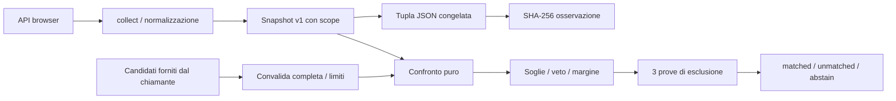

# Architettura

`src/collect.ts` legge soltanto sei proprietà note, normalizza cinque segnali e degrada i dati bloccati a null. Le stringhe grezze dello user agent non escono dal collector. Le classi numeriche sono arrotondate per difetto, senza creare entropia nuova.

`src/schema.ts` convalida forme esatte, schemi, namespace e limiti; `parseSnapshot` controlla la dimensione prima di JSON.parse. Un insieme massimo di 256 snapshot da massimo 2.048 unità di codice ciascuno rappresenta un budget di trasporto di circa 1 MiB di testo UTF-16, esclusi envelope e ID: il chiamante deve imporre il proprio limite al body aggregato. La libreria non riceve body HTTP.

`src/digest.ts` congela ordine dei campi e separazione con una tupla JSON. Schema e scope partecipano all’hash; la policy non partecipa perché descrive il matching e non l’osservazione. Non ci sono timestamp, valori casuali o identificatori hardware.

`src/match.ts` valida ogni candidato prima di decidere, senza mutarlo. Con 5 segnali e 3 prove ridotte, valutazione e selezione costano **O(C)**, con C ≤256. I contributi seguono l’ordine fornito dal chiamante; esito e prove di esclusione sono invarianti rispetto a quell’ordine. Il criterio lessicografico degli ID rende deterministica la scelta del rivale nei report e non rompe mai i pareggi ai fini del match, che richiede comunque un margine positivo. Ogni prova ridotta ricalcola veto e confronto su tutti i candidati. La libreria non usa l’esito per assegnare permessi o modificare archivi.

Le prestazioni e il consumo di memoria sono misurati dai comandi di benchmark. Il numero di letture e la dimensione dei dati normalizzati sono limitati; un getter/proxy ostile nello stesso processo non può essere interrotto in modo sicuro e non rientra nel modello di isolamento.

Il controllo delle famiglie non implica indipendenza statistica. La stessa famiglia di piattaforma, CPU e impostazioni può essere condivisa da molti dispositivi. Per misurare utilità operativa servono una coorte etichettata, osservazioni nel tempo e tassi di falsi abbinamenti, separazioni e astensioni.
