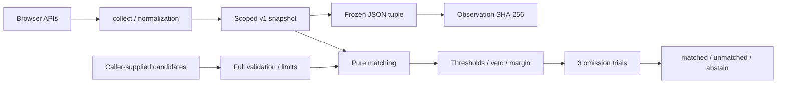

# Architecture

`src/collect.ts` reads only six known properties, normalizes five signals, and falls back to null for blocked data. Raw user agent strings never leave the collector. Numeric buckets are rounded down, without creating new entropy.

`src/schema.ts` validates exact shapes, schemas, namespaces, and limits; `parseSnapshot` checks size before JSON.parse. A maximum set of 256 snapshots, each at most 2,048 code units, represents a transport budget of approximately 1 MiB of UTF-16 text, excluding envelopes and IDs: the caller must enforce its own aggregate body limit. The library does not receive HTTP bodies.

`src/digest.ts` freezes field order and separation with a JSON tuple. Schema and scope participate in the hash; policy does not, because it describes matching rather than the observation. There are no timestamps, random values, or hardware identifiers.

`src/match.ts` validates every candidate before deciding, without mutating it. With 5 signals and 3 reduced trials, evaluation and selection cost **O(C)**, with C ≤256. Contributions follow the caller's input order; the outcome and omission trials are invariant to that order. Lexicographic ID ordering makes rival selection in reports deterministic and never breaks ties for matching, which still requires a positive margin. Each reduced trial recalculates the veto and comparison across all candidates. The library does not use the outcome to assign permissions or modify storage.

Performance and memory usage are measured by the benchmark commands. The number of reads and the size of normalized data are bounded; a hostile getter or proxy in the same process cannot be interrupted safely and falls outside the isolation model.

Family checks do not imply statistical independence. Many devices may share the same platform family, CPU, and settings. Measuring operational usefulness requires a labeled cohort, observations over time, and rates of false matches, false splits, and abstentions.
