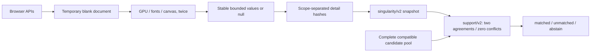
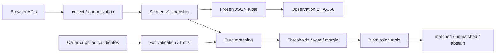

# Architecture

The library exposes two versioned pipelines. The network agent defaults to detailed observations; legacy exports keep their original wire format and behavior.

`src/detailed.ts` isolates built-in rendering probes from host styles and web fonts. A synchronous probe pair must agree; failures remain null. The frame is removed before Web Crypto hashing. Platform and resource normalization are reused from `collect.ts`; canvas dimensions are fixed and unrelated to the display. These observations may still change with browser rendering, fonts, privacy settings and graphics drivers.

`src/detailed-schema.ts` enforces exact keys, `web/v1` probe revision, nullable 64-character lowercase detail hashes and a 4,096-code-unit JSON limit. `src/detailed-match.ts` requires matching known platform/core buckets, two equal details and no comparable conflicts. Incomplete compatible rivals block a winner. Selection is O(C), with C ≤256, and never uses input order to break ties. See [the detailed contract](DETAILED.md).

The Python kernel dispatches on schema and has deterministic parity tests against TypeScript. The backend partitions anchors by schema. `server/singularity/retrieval.py` removes only permanent v2 contradictions in platform, core bucket and available details before reading up to the overflow boundary. Null or missing candidate fields are retained; they cannot be treated as agreements. Four partial indexes cover the three available-detail pairs and the full triple, with expiry immediately after the constrained fields. It never chooses from a silently truncated list. Inferred anchors stay immutable; authenticated possession of a valid scoped enrollment token can retain continuity across schema upgrades. See [candidate retrieval](DETAILED.md#candidate-retrieval).

A global lock preserves the atomic candidate-read/assignment/write operation. Admission is capped at 32 requests, with a two-second lock-acquisition budget. This absorbs short concurrent bursts while retaining bounded backpressure. The supported topology is still one API worker with MongoDB and a separate recovery ledger.

## Legacy pipeline

`src/collect.ts` reads only six known properties, normalizes five signals, and falls back to null for blocked data. Raw user agent strings never leave the collector. Numeric buckets are rounded down, without creating new entropy.

`src/schema.ts` validates exact shapes, schemas, namespaces, and limits; `parseSnapshot` checks size before JSON.parse. A maximum set of 256 snapshots, each at most 2,048 code units, represents a transport budget of approximately 1 MiB of UTF-16 text, excluding envelopes and IDs: the caller must enforce its own aggregate body limit. The library does not receive HTTP bodies.

`src/digest.ts` freezes field order and separation with a JSON tuple. Schema and scope participate in the hash; policy does not, because it describes matching rather than the observation. There are no timestamps, random values, or hardware identifiers.

`src/match.ts` validates every candidate before deciding, without mutating it. With 5 signals and 3 reduced trials, evaluation and selection cost **O(C)**, with C ≤256. Contributions follow the caller's input order; the outcome and omission trials are invariant to that order. Lexicographic ID ordering makes rival selection in reports deterministic and never breaks ties for matching, which still requires a positive margin. Each reduced trial recalculates the veto and comparison across all candidates. The library does not use the outcome to assign permissions or modify storage.

Performance and memory usage are measured by the benchmark commands. The number of reads and the size of normalized data are bounded; a hostile getter or proxy in the same process cannot be interrupted safely and falls outside the isolation model.

Family checks do not imply statistical independence. Many devices may share the same platform family, CPU, and settings. Measuring operational usefulness requires a labeled cohort, observations over time, and rates of false matches, false splits, and abstentions.
