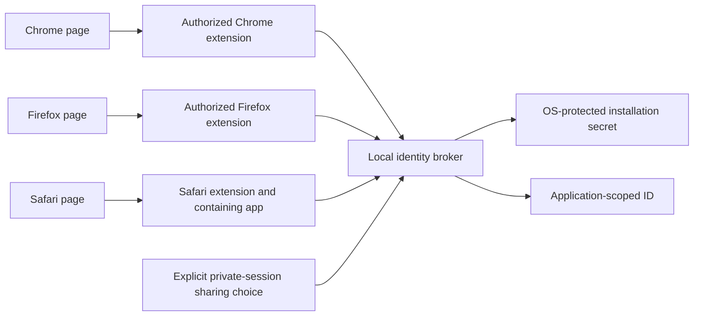

# Stronger fingerprints and cross-browser identity

Research date: **7 October 2026**. Scope: the existing automatic, probabilistic, display-independent library, plus a feasibility study of sharing an identifier across browsers and private sessions. This document records research and design hypotheses for additional signals and cross-browser sharing. Version 0.2 adds an optional [self-hosted platform](PLATFORM.md) with event storage, an API and explicit browser-local enrollment. The core collector is unchanged; no cross-browser identity bridge is implemented.

## Findings

A website can sometimes recognize similar observations across browsers without transferring any state. That is probabilistic correlation. Recovering the exact random identifier created in another browser is a different problem: it requires a shared store, an explicit transfer, or a backend that already knows the association. Hashing more fields cannot supply that missing communication channel.

There is no supported, universal, zero-setup web mechanism that guarantees the same physical-device identifier in arbitrary browsers and private sessions. This is not a claim that privacy boundaries are immune to side channels. W3C documents both fingerprinting and transient-event correlation; those are information leaks, not a durable interoperability contract. [W3C fingerprinting guidance](https://www.w3.org/TR/fingerprinting-guidance/).

Two directions deserve separate evaluation:

1. **Browser-only:** improve normalization and evaluate additional signals against independently labelled data. Preserve uncertainty and abstention. Expect collisions and missed continuity.
2. **Explicit shared identity:** optionally install a local component or let the user associate sessions. This can preserve an application-assigned ID, but changes the original no-installation/no-association requirement. It identifies an enrollment or installation, not an immutable physical PC.

## What “more unique” must mean

Four properties must be measured independently: distinctness between different devices, repeatability on one browser, agreement across browsers, and continuity over time. An API feature vector can distinguish browser versions very well while making cross-browser agreement worse. A constant value has perfect stability and no discriminating power.

For an observation distribution with probabilities `p(x)`, the exact collision probability for two independent draws is `sum(p(x)^2)`. With `N` independent draws, the expected number of colliding pairs is `N * (N - 1) / 2 * sum(p(x)^2)`. Under the hypothetical uniform distribution over `2^b` observations this becomes `N * (N - 1) / 2^(b + 1)`. The relevant collision entropy is `-log2(sum(p(x)^2))`; do not substitute Shannon entropy or add correlated per-field entropy estimates. These formulas describe exact observation collisions, not fuzzy matcher error rates.

SHA-256 output length does not create 256 bits of device information. A longer hash, salt, encryption, or random UUID cannot make identical observations distinguishable. A UUID avoids accidental ID collisions only when a separate mechanism can recover the same stored UUID later.

The 2017 NDSS cross-browser study reported **83.24% cross-browser uniqueness and 91.44% cross-browser stability** on its dataset. Its often-quoted **99.24%** result concerned the single-browser setting. These are historical sample results, not current accuracy estimates for this library or guarantees for private browsing. [Cao, Li, and Wijmans, paper and Table II](https://www.ndss-symposium.org/wp-content/uploads/2017/09/ndss2017_02B-3_Cao_paper.pdf).

## Signal inventory

“Available” means observable under some browser configurations, not necessarily exact, immutable, supported everywhere, or useful after conditioning on the existing signals. The recommendations below are hypotheses to evaluate, not measured improvements.

| Signal | Potential benefit | Stability and compatibility limits | Research disposition |
|---|---|---|---|
| Coarse OS/platform | Useful broad separation; already collected | Declared data, emulation and desktop modes; many devices share it | Keep as coarse evidence; test ambiguous classifications |
| Logical CPU count | Some hardware discrimination; already collected | Browser may report fewer processors; VM configuration and restrictions differ | Keep bounded; measure browser-pair disagreement rather than assume exact hardware [API](https://developer.mozilla.org/en-US/docs/Web/API/Navigator/hardwareConcurrency) |
| Approximate RAM | Some compute-class separation; already collected | Rounded and clamped; bounds can change; absent in some browsers | Keep optional; do not treat it as measured RAM or double-count correlation with CPU [specification](https://www.w3.org/TR/device-memory/) |
| CPU architecture and bitness from UA Client Hints | May separate x86/ARM classes without screen data | Limited browser support; returned subset can be restricted; process/platform reporting is not a CPU serial | First additional-signal experiment, optional and separate from v1 digest [API](https://developer.mozilla.org/en-US/docs/Web/API/NavigatorUAData/getHighEntropyValues/) |
| Mobile model/form factor from Client Hints | May separate product classes | Same model can represent millions of devices; desktop model often empty; not universally exposed | Evaluate conditional gain only; no mandatory model field [specification](https://wicg.github.io/ua-client-hints/) |
| Base language and time zone | Broad locale evidence; already collected | Browser-specific settings, travel, alias/database changes, privacy controls | Test versioned alias normalization; never equate location settings with hardware identity |
| Font presence or writing-script coverage | Historically useful OS/application information | Installed software and fonts change; rendering and visibility differ; privacy controls reduce/randomize exposure | Research-only supplementary family, not a stable anchor [Brave font protections](https://brave.com/privacy-updates/17-language-fingerprinting/) |
| Direct installed-font enumeration | Richer inventory | Limited availability and explicit font permission; can expose distinctive software choices | Exclude from automatic collection [Local Font Access](https://developer.mozilla.org/en-US/docs/Web/API/Local_Font_Access_API) |
| GPU vendor, renderer, adapter descriptors, extension sets | May separate hardware classes | Shared models, driver/API changes, software rendering, GPU switching and privacy transformations | At most an isolated experiment; no default identity anchor [Brave GPU protections](https://brave.com/privacy-updates/38-webgl-webgpu-fingerprinting-protections/) |
| Canvas/WebGL pixels and offline audio samples | Can add rendering-stack distinctions | Browser/OS implementations and privacy noise undermine repeatability | Exclude from a “certain data” claim; no mitigation bypass [WebKit mechanisms](https://webkit.org/blog/15697/private-browsing-2-0/) |
| Audio output sample rate or latency | Small configuration signal | Default sample rate depends on the output device | Reject as an anchor; a display with a different audio output can indirectly violate the monitor-change requirement [AudioContext](https://developer.mozilla.org/en-US/docs/Web/API/AudioContext/AudioContext) |
| Codec support, JavaScript math, WebAssembly features | Can classify execution environments | Primarily browser/OS/capability evidence, vulnerable to updates and CPU load for timings | Diagnostics only until cross-browser incremental value is demonstrated |
| Screen, viewport, zoom, color depth, pixel ratio, touch/peripheral state | Often discriminating | Conflicts with display/peripheral invariance | Continue excluding from identity |
| IP address and network behavior | Sometimes useful candidate search context on a backend | NAT groups different devices; VPN, roaming and relays change addresses; does not transfer a secret | Never proof of same PC; any contextual use needs separate evaluation [NDSS analysis](https://www.ndss-symposium.org/ndss2017/ndss-2017-programme/cross-browser-fingerprinting-os-and-hardware-level-features/) |
| Camera/microphone `deviceId`, `groupId` | Selects permitted media sources | Origin/session semantics; device IDs rotate with cleared storage, and devices can be replaced | Not cross-browser computer IDs [Media Capture specification](https://www.w3.org/TR/mediacapture-streams/) |
| USB peripheral serial | Can identify a selected peripheral | Device selection requires activation/permission; limited support; identifies that peripheral, which can move between PCs | Not an automatic PC identifier [serialNumber](https://developer.mozilla.org/en-US/docs/Web/API/USBDevice/serialNumber), [requestDevice](https://developer.mozilla.org/en-US/docs/Web/API/USB/requestDevice) |
| WebAuthn credential | Strong proof of possession for a relying party | Enrollment and user participation; synced passkeys may exist on multiple devices | Useful explicit association/authentication option, not a passive physical ID [WebAuthn Level 3](https://www.w3.org/TR/webauthn-3/) |

Modern mitigations change the value of old research. WebKit documents noise in canvas/WebGL readback and WebAudio, as well as reduced screen metrics. Brave's August 2026 announcement describes generic WebGL strings, empty WebGPU descriptors, and randomized WebGL extension lists starting with its 1.93 rollout. Do not generalize a historical prototype's results to these configurations. [WebKit](https://webkit.org/blog/15697/private-browsing-2-0/), [Brave](https://brave.com/privacy-updates/38-webgl-webgpu-fingerprinting-protections/).

DrawnApart demonstrates that GPU timing can distinguish devices in an experimental setting; that makes it relevant research, not a production-ready promise. It adds workload and a timing-dependent measurement, with its own environment and evaluation assumptions. It does not establish universal cross-browser, private-session, or permanent identity for Singularity. [NDSS research](https://www.ndss-symposium.org/ndss-paper/drawnapart-a-deep-learning-enhanced-gpu-fingerprinting-technique/).

## Can browsers communicate on the same PC?

| Mechanism | Ordinary web page capability | Different browsers | Normal/private and later private sessions |
|---|---|---|---|
| Cookies, localStorage, IndexedDB, Cache Storage, origin-private file storage | State within browser-managed origin/partition boundaries | No general shared store | Private storage is separate and generally removed when the private session ends [storage rules](https://developer.mozilla.org/en-US/docs/Web/API/Storage_API/Storage_quotas_and_eviction_criteria) |
| `BroadcastChannel`, storage events | Coordination within eligible same-origin storage partitions | No cross-application discovery/transport | Not a bridge across isolated storage contexts [HTML messaging](https://html.spec.whatwg.org/multipage/web-messaging.html#broadcasting-to-other-browsing-contexts) |
| SharedWorker / Service Worker | Coordination among clients managed by that browser | No shared worker process across independent browsers | Not a persistent bridge into another browser's private storage [WebKit partitioning](https://webkit.org/tracking-prevention/) |
| `postMessage` / MessagePort | Messaging when an existing window/port relationship is available | Cannot obtain another browser application's Window object | Does not manufacture a cross-browser relationship [HTML messaging](https://html.spec.whatwg.org/multipage/web-messaging.html) |
| Storage Access API | Requests access to otherwise partitioned state in embedded contexts | Does not import another browser's profile | Does not merge regular/private profiles [API scope](https://developer.mozilla.org/en-US/docs/Web/API/Storage_Access_API) |
| WebSocket / HTTPS relay | Both browsers can contact one server | Yes, transport is straightforward | Yes, but the server still needs a justified association; shared IP is insufficient |
| WebRTC data channel | Peer communication after signaling and connection setup | Possible between cooperating peers | Signaling/rendezvous and association are still required; no automatic same-PC identity service [WebRTC](https://www.w3.org/TR/webrtc/) |
| Browser extension storage | State owned by an installed extension | Chrome extension storage is not Firefox extension storage | Chrome extension local/sync storage can be shared with its incognito processes when enabled; this is not website localStorage [Chrome incognito](https://developer.chrome.com/docs/extensions/reference/manifest/incognito) |
| Extension + native host | Installed extension can contact an installed native application | Feasible: both browser integrations can use one application-owned store | Feasible only when enabled and supported; private access needs an explicit product policy [Chrome host](https://developer.chrome.com/docs/extensions/develop/concepts/native-messaging), [Firefox host](https://developer.mozilla.org/en-US/docs/Mozilla/Add-ons/WebExtensions/Native_messaging) |
| Installed loopback service | A cooperating local application can expose an endpoint | Feasible with installation and browser access constraints | Access is not universally silent; permission and lifecycle behavior differ [Local Network Access](https://developer.chrome.com/blog/local-network-access), [current permission overview](https://developer.mozilla.org/en-US/docs/Web/Security/Defenses/Local_network_access) |
| One-time pairing code or authenticated session | Explicitly associates sessions through an application service | Feasible | Feasible with user participation each time required; identifies association, not necessarily same hardware |

Browser extensions need separate packages/registration and compatibility validation. Firefox has its own native-host manifest and private-window rules. Safari communicates with its containing application through its own integration, so a Chrome native-host manifest is not a Safari implementation. Safari extensions with website/history access are disabled in private browsing by default unless the user enables them. [Firefox native messaging](https://developer.mozilla.org/en-US/docs/Mozilla/Add-ons/WebExtensions/Native_messaging), [Firefox private extension behavior](https://developer.mozilla.org/en-US/docs/Mozilla/Add-ons/WebExtensions/manifest.json/incognito), [Apple app messaging](https://developer.apple.com/documentation/safariservices/messaging-between-the-app-and-javascript-in-a-safari-web-extension), [Safari private extensions](https://webkit.org/blog/15697/private-browsing-2-0/).

Incognito does not make every visit unrecognizable, but it intentionally separates browser-managed state. A successful probabilistic match there is not evidence that an ID was transferred. Conversely, an extension that has shared state does not automatically make it available to every website: an authorized extension-to-page interface is still needed.

Historical covert channels are relevant limitations of browser isolation. Pool-Party demonstrated resource-pool channels, including cross-profile tracking in tested Gecko configurations. This is not evidence that arbitrary current browser pairs offer a stable shared bus. Cache/HSTS resurrection, resource-contention channels, port scanning and incognito-detection workarounds are unsuitable dependencies for this library's supported identity contract. No such mechanism was implemented or tested against users. [USENIX Security 2023](https://www.usenix.org/conference/usenixsecurity23/presentation/snyder).

## Candidate architecture for an optional shared ID

This is a design hypothesis requiring a separate implementation and validation effort. It requires an installed component beyond the browser-only library.

The broker creates one random secret on first authorized use, stores it under the local OS user, and derives a separate identifier per approved application/origin, for example with domain-separated HMAC. All supported integrations query that same store. The secret stays native; the page receives only its scoped result. If preserving an ID originally created by the first browser is essential, enroll that existing ID through an authorized binding ceremony; do not accept an arbitrary page-supplied ID as ownership proof.

The identity is **installation/enrollment identity**. Reinstalling, deleting the secret, changing OS account, or restoring/cloning a backup can change or duplicate it. Hardware-protected storage can improve key custody but does not justify a universal physical-machine claim. Do not use raw machine UUIDs or hardware serials as a replacement.

A review must require exact extension and origin allowlists, trusted sender validation rather than trusting an `origin` string inside a message, bounded requests, fresh challenges and replay control for any proof protocol, revocation and visible deletion. Browser-native messaging allowlists authorize extensions; website authorization must be enforced separately by the trusted integration. An ID alone grants no permissions. A shared ID and a cryptographic authentication assertion are different products.

Private contexts should remain isolated by default. The user must enable the extension in private mode and separately choose to share this application's identity there. A manifest setting alone is not consent to link browsing. When sharing is declined, return unavailable or an ephemeral identity; do not silently fall back to a covert bridge. Offer deletion/rotation in the broker and explain that clearing website data alone does not delete an installed application's state.

A loopback broker is an alternative when extension deployment is impractical, not a zero-install shortcut. It needs authenticated enrollment, restrictive origin/Host checks, CSRF and DNS-rebinding defenses, and browser-specific access tests. CORS alone is not authentication. Chrome introduced permission-gated Local Network Access in version 142; current documentation distinguishes local-network and loopback permissions. Do not depend on historical gaps in which transports were covered. [Chrome release notes](https://developer.chrome.com/release-notes/142), [current LNA documentation](https://developer.mozilla.org/en-US/docs/Web/Security/Defenses/Local_network_access).

## Browser-only improvement experiments

These experiments preserve the original no-login/no-association production mode. Independently labelled evaluation is still necessary even if production users never enroll.

1. **Correct normalization before collecting more data.** Test time-zone alias handling and ambiguous platform reporting against pinned fixtures. A normalization change requires a new schema; never silently change v1 hashes.
2. **Separate observations from identity decisions.** Keep the current core snapshot and frozen digest. Explore a versioned, opt-in evidence envelope with provenance and statuses such as observed/unavailable/blocked. Absence must not itself become a unique positive signal. A prospective async collector must have bounded work and no permissions prompts by default.
3. **Try architecture/bitness first.** Measure coverage and incremental discrimination, especially when one browser lacks Client Hints. Unsupported data must not disqualify an otherwise valid observation. Do not “fill in” missing values from a claimed match.
4. **Evaluate correlated groups, not a larger hash.** Compare the existing family-omission policy with a calibrated model of same-device versus different-device pairs. Cap evidence from correlated families. Keep a candidate-retrieval recall test: the right candidate missing from the list invalidates apparent uniqueness.
5. **Evaluate bounded historical observations offline.** Multiple observations can tolerate drift, but pairwise similarity is not transitive. A→B and B→C must not automatically merge A with C. Avoid training on the matcher's own labels or appending every guessed match; both can poison identity history.
6. **Promote only demonstrated gains.** Add a signal only when it improves recall or reduces abstention at a predeclared false-match constraint across the tested browser pairs. Keep experimental collectors separate and disabled outside the evaluation environment until that condition is met.

Evaluation should include identical-model devices, corporate images, VMs, different OS users, fresh profiles, normal/private contexts, restarts, updates, monitor/dock/audio changes and privacy protections. Use device-disjoint and time-disjoint train/calibration/test partitions. Report false matches, false splits, abstentions, recall, candidate retrieval failures, coverage, latency and uncertainty by browser pair. With zero observed errors, the usual approximate `3/n` upper 95% bound requires suitable independent trials; correlated all-pairs comparisons do not supply `n` independent devices.

An initial 50–100-device study can expose obvious collisions and drift but cannot substantiate extremely low false-match rates. Choose the production error target and sample size before accepting a new policy. No such population study has been run here, and no accuracy improvement is claimed.

## Local communication experiment

An isolated local experiment ran on one macOS host with Playwright Chromium **145.0.7632.6** and WebKit **26.0**. It used a localhost origin, temporary profiles, a random test marker, and no personal browser profiles. Both engines had positive BroadcastChannel controls; negative delivery observations used a 750 ms window after listeners were registered.

| Experiment | Result |
|---|---|
| Two Chromium tabs in the same persistent profile share cookie, localStorage and BroadcastChannel | PASS |
| An isolated Chromium context does not receive that profile's state/message | PASS |
| A persistent WebKit profile does not receive Chromium's state/message | PASS |
| An isolated WebKit context does not receive Chromium's state/message | PASS |
| WebKit same-profile BroadcastChannel positive control | PASS |
| Close an isolated Chromium context, then open a fresh one: previous state absent | PASS |
| Reopen the same persistent Chromium profile: its own cookie/localStorage remain | PASS |

These checks demonstrate the tested boundaries; absence of a message in a bounded test is not a proof against all covert channels. Playwright isolated contexts model independent storage sessions, not every detail of branded Chrome/Safari incognito UI. Firefox, native messaging, real extension private-mode enrollment, loopback permissions and hardware changes were not exercised in this experiment. The earlier successful three-engine library CI run did not test these new communication scenarios. [Playwright context isolation](https://playwright.dev/docs/browser-contexts).

The experiment used temporary profiles, which were removed at completion. Raw research artifacts are not included in the distributed package.

## Offline evaluation

Version 0.2 includes `singularity evaluate` for independently labeled JSONL observations. It reports output-ID continuity, false links, missed links, coverage, cross-browser pairs and device-balanced summaries. See the [evaluation contract and collection protocol](EVALUATION.md). This command is offline and does not modify production identification behavior.

## Implementation status

The research supports evaluating stronger probabilistic evidence and, as a separate product option, an explicitly enabled shared installation ID. It does not establish that either improves this library in production yet.

The original five-signal collector, snapshot hashing and family-omission matcher remain available through the [legacy API](LEGACY.md). Version 0.3 also implements the bounded GPU, font-availability and canvas probes described in the [detailed API](DETAILED.md). Other collectors and shared-identity transports discussed here remain research directions, not available APIs.
